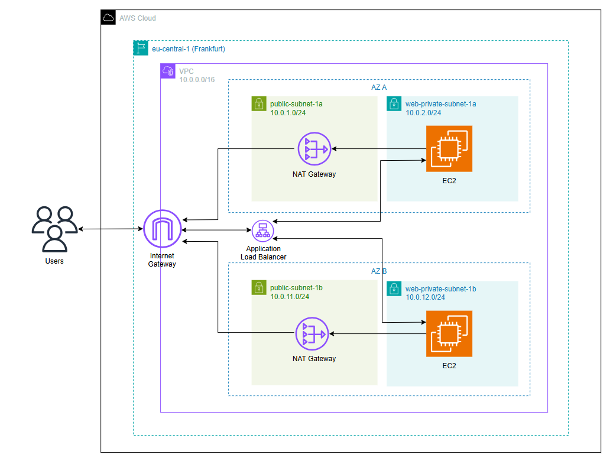
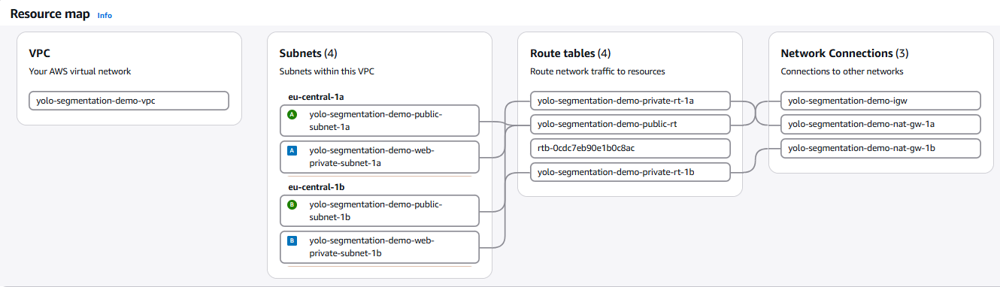
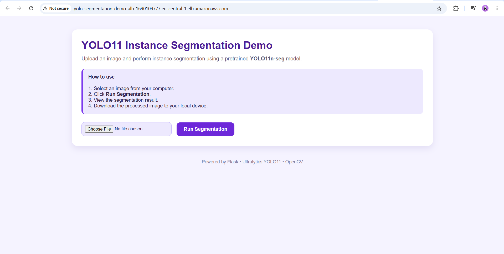
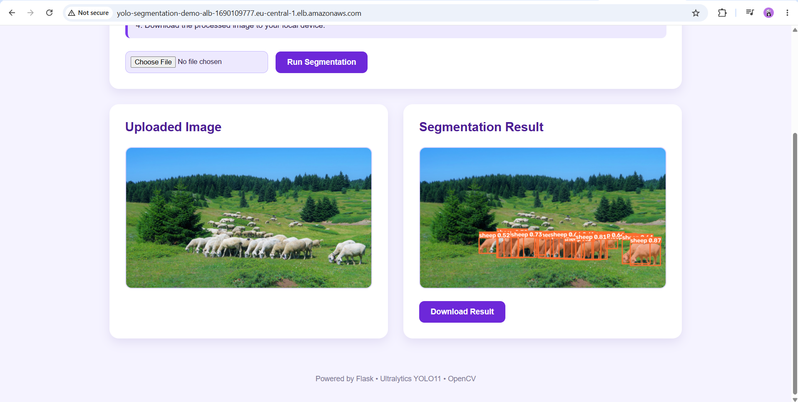

# 🚀 YOLO11 Instance Segmentation on AWS with Terraform

Deploy a Dockerized **YOLO11 Instance Segmentation** web application on AWS using **Terraform**.

The infrastructure follows Infrastructure as Code (IaC) principles and is designed with high availability, private networking, and automated provisioning. EC2 instances are configured automatically using `user_data.sh`, build the Docker image, download the YOLO11 model, and start the application without manual intervention.

---

# 🏗️ Architecture

The infrastructure is deployed across **two Availability Zones** in the **eu-central-1 (Frankfurt)** region.

- Application Load Balancer distributes traffic across two EC2 instances.
- EC2 instances are deployed in private subnets.
- NAT Gateways provide outbound Internet access.
- Health checks automatically remove unhealthy instances.
- Sticky Sessions (cookie-based) keep users connected to the same backend instance.

### AWS Cloud Architecture



### AWS VPC Resource Map



---

# ⚙️ Engineering Decisions

### Sticky Sessions

Processed images are temporarily stored in the `static/uploads` directory. Sticky Sessions ensure that requests from the same user are routed to the same EC2 instance, preventing missing file errors.

### Swap Memory

A **4 GB swap file** is created automatically during instance initialization, allowing Docker image builds and PyTorch installation to complete successfully on **t3.micro** instances.

### Security

- EC2 instances are deployed in private subnets.
- Only the Application Load Balancer can access the application on port **5000**.
- Internet traffic reaches the application exclusively through the load balancer.

---

# 💰 Cost Estimation

The infrastructure cost was estimated using **Infracost**.

| Resource | Estimated Monthly Cost |
|-----------|----------------------:|
| Application Load Balancer | $19.71 |
| EC2 (t3.micro) | $8.76 |
| EBS Volume (8 GB) | $0.95 |
| **Estimated Total** | **~$29.42 / month** |

> Data transfer and ALB LCU charges depend on actual usage.

---

# 🖥️ Application

The web interface allows users to upload an image and perform **instance segmentation** using the **YOLO11** model.

### Home Page



### Segmentation Result



---

# 🚀 Deployment

## Run Locally

```bash
cd app

docker build -t yolo-segmentation .

docker run -d -p 5000:5000 yolo-segmentation
```

Open:

```
http://localhost:5000
```

---

## Deploy to AWS

Create a `terraform.tfvars` file.

```hcl
ami_id          = "ami-xxxxxxxxxxxxxxxx"
github_repo_url = "https://github.com/<username>/terraform-aws-yolo-segmentation-demo.git"
```

Initialize Terraform.

```bash
terraform init
```

Review the execution plan.

```bash
terraform plan
```

Deploy the infrastructure.

```bash
terraform apply
```

When the deployment is complete, open the **Application Load Balancer DNS** output in your browser.

To remove all resources:

```bash
terraform destroy
```

---

# 🛠️ Technologies

- Terraform
- Amazon Web Services (VPC, EC2, ALB, NAT Gateway, Security Groups)
- Docker
- Flask
- Python 3.11
- Ultralytics YOLO11 (yolo11n-seg)
- PyTorch
- OpenCV
- Pillow